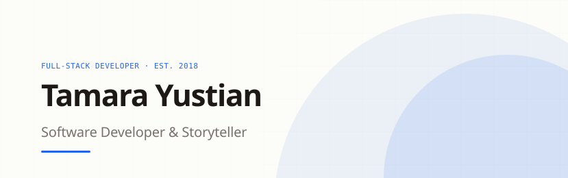

<picture>
  <source media="(prefers-color-scheme: dark)" srcset="images/banner-dark.svg">
  
</picture>

<b>ABOUT</b>

## I make complex software feel simple.

I'm a full-stack developer with six years of shipping software across TypeScript, React, and Node.js. I work with engineering and business teams to take a feature from a rough requirement to production — sprint planning, mockups, and data design that keep the code clean and the intent clear. I also run AWS and Cloudflare infrastructure and own CI/CD.

Away from code I photograph, edit video, and write. It's the same instinct. A good story has a structure, and so does a product that feels easy to use.

**Current:** open to roles where I can own the path from requirement to production.

<b>STACK</b>

<picture><source media="(prefers-color-scheme: dark)" srcset="https://github-stats-extended.vercel.app/api/top-langs/?username=tamarayustian&layout=compact&langs_count=8&theme=transparent&title_color=F8F8F1&text_color=AAA6A1&icon_color=3C83F6&hide_border=true"></picture>

<b>TECHNOLOGY</b>

<table align="center">
  <tr>
    <td><code>TypeScript</code></td>
    <td><code>React</code></td>
    <td><code>Next.js</code></td>
    <td><code>Node.js</code></td>
  </tr>
  <tr>
    <td><code>Vue.js</code></td>
    <td><code>Python</code></td>
    <td><code>Express</code></td>
    <td><code>TailwindCSS</code></td>
  </tr>
  <tr>
    <td><code>PostgreSQL</code></td>
    <td><code>Redis</code></td>
    <td><code>AWS</code></td>
    <td><code>Cloudflare</code></td>
  </tr>
  <tr>
    <td><code>Flutter</code></td>
    <td><code>Vite</code></td>
    <td><code>Railway</code></td>
    <td><code>Vercel</code></td>
  </tr>
</table>

<b>NOW</b>

Building [stewards](https://stewards-nine.vercel.app), an expense sharing web-app that skips the awkward messages.

<b>SELECTED WORK</b>

- [Arise Asia](https://www.ariseasia.org) — built site for international conferences with 4000+ in attendance and 5+ other international editions
- [Harvest Mission Community Church of Hong Kong](https://hk.hmccglobal.org) — church site that I built as a volunteer
- [Canon LIFE Group Leaders](https://canon-boom.vercel.app) — thank-you web app for small group leaders
- [Git LIFE Group Leader](https://git-randall.vercel.app) — thank-you notes styled as commit messages

<b>CONNECT</b>

[Email](mailto:tamarayustian@gmail.com) · [LinkedIn](https://www.linkedin.com/in/tamara-yustian) · [Writing](https://medium.com/@tamarayustian) · [Readme source](https://github.com/tamarayustian/tamarayustian)
